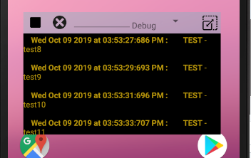
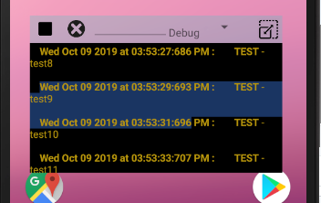
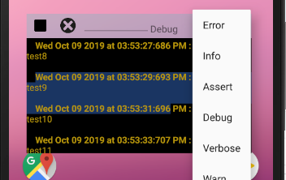
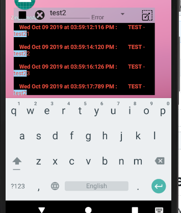

# Hướng dẫn cài đặt và sử dụng tool Log Show Service
## Cài đặt
Tại build.gradle của Project
```
      allprojects {
		repositories {
			...
			maven { url 'https://jitpack.io' }
		}
	}
```
Tại build.gradle của app
```
      dependencies {
	        implementation 'com.github.hieupham9809:log-handle-android-maven:1.0'
	}
```

Sau đó Sync lại project
#### 4. Tại activity nào đó, truyền vào parser cho file log, tạo FloatingLogViewService, sau đó gọi hàm startSelf và truyền vào đường dẫn file log:
(Lưu ý request quyền draw over app)

```java
      HtmlIParser htmlIParser = new ZingTVHtmlParser();
      FloatingLogViewService.setHtmlParserAdapter(htmlIParser);
      FloatingLogViewService floatingLogViewService = new FloatingLogViewService();
      floatingLogViewService.startSelf(this, "/storage/emulated/0/Download/31-10-2019.html");
```

## Sử dụng
#### 1. Floating window có thể kéo thả


#### 2. Main window có thể kéo thả



+ icon ô vuông và tam giác (stop & play) để dừng hoặc tiếp tục stream log (real time)

+ icon X để toggle về floating window

#### 3. Double tap và di chuyển tới vị trí mong muốn để select text,
nhấn giữ để copy



#### 4. Nhấn vào selection box để chọn filter theo loại log



#### 5. Nhập vào ô textbox để filter theo keyword xuất hiện trong log



#### 6. Kéo thả ở icon góc trên bên phải để resize theo ý muốn. Hoặc kéo thả ở khoảng trống để di chuyển window đến vị trí mong muốn 


